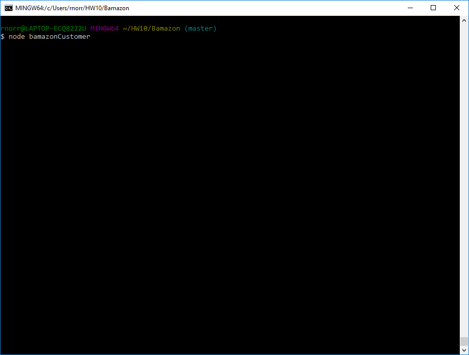

# Bamazon
A Node marketplace app using MySQL to hold product information

bamazonCustomer.js allows the user to buy a chosen number of items from the inventory and, if there is enoungh of that product in stock, tells the user how many of the product they ordered and how much the total cost to them is. If there is not enough stock, the user is informed of how many of that item are left. Upon completion of the user's buy request, bamazonCustomer.js updates the database inventory values and then runs again to get another user buy request.

Process GIF:

Required NPM modules:
- mysql
- inquirer
- cli-table

CLI command to run app:
- node bamazonCustomer

CLI command to close app:
- CTRL/Command c

Have Fun and Happy Buying!
